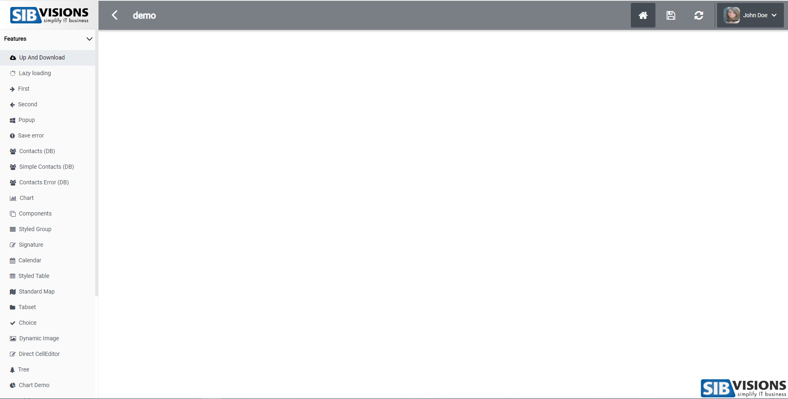
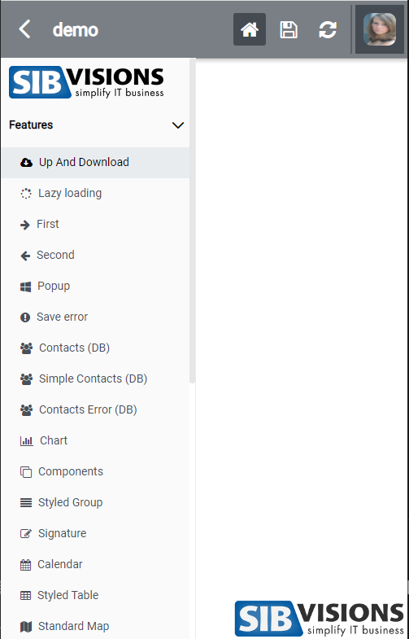
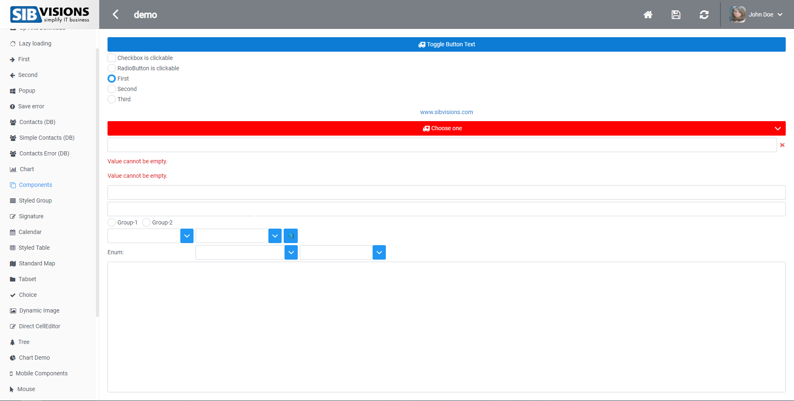
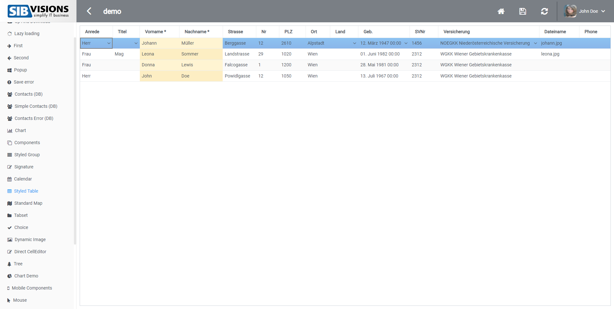

# Screenshots for basti Theme
This is the default theme of the reactUI. In the following screenshots, I have enabled hovering on some elements to show their size.

## Standard Menu Fullscreen

## Standard Menu Small

## Corporation Menu

## Components Screen

## Table Screen

