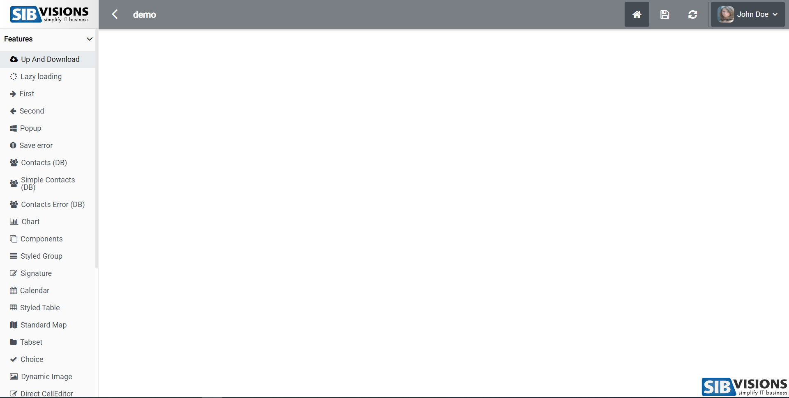
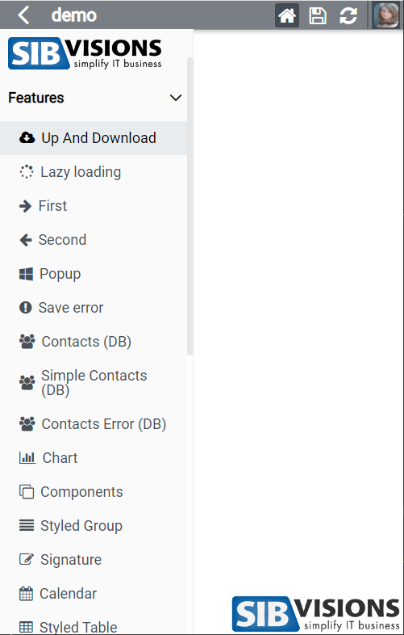
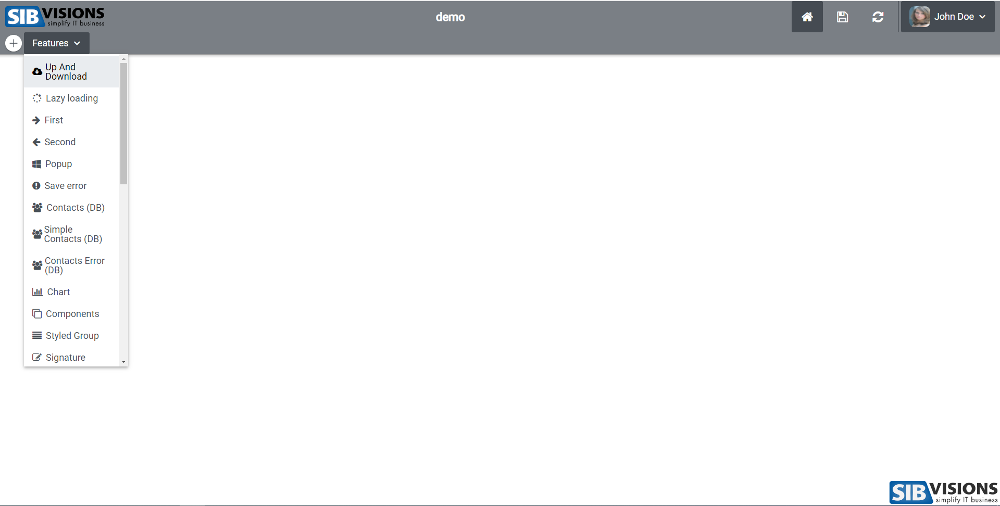
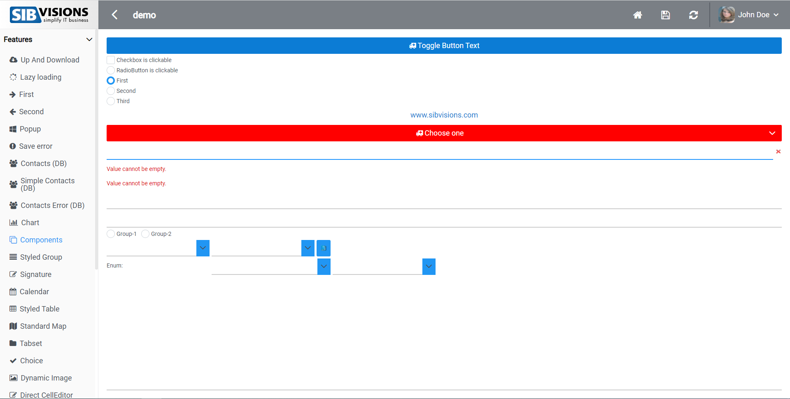
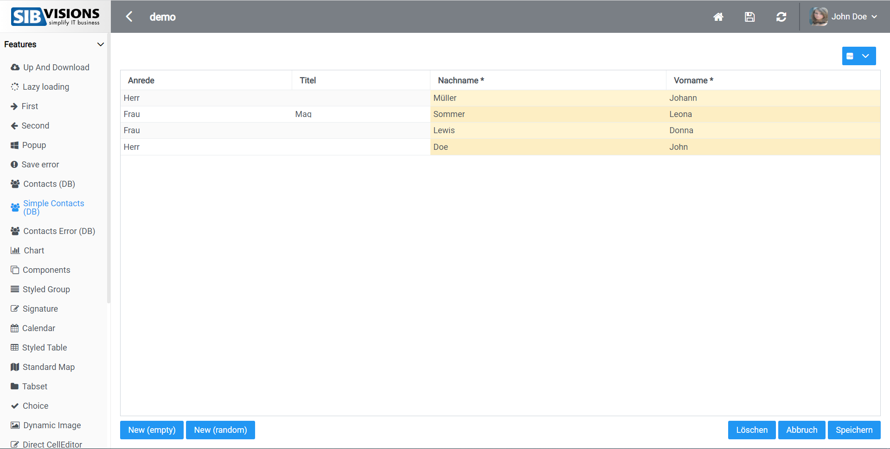

# Basti_mobile Theme Showcase
This is the mobile theme of the reactUI. In the following screenshots, I have enabled hovering on some elements to show their size. This theme has bigger menu items so it is easier to tap them and the borders of the text editors are also different. Also when the browser is small, the topbar gets smaller, so there is more visible screen area.

## Standard Menu Fullscreen

## Standard Menu Small

## Corporation Menu

## Components Screen

## Table Screen

