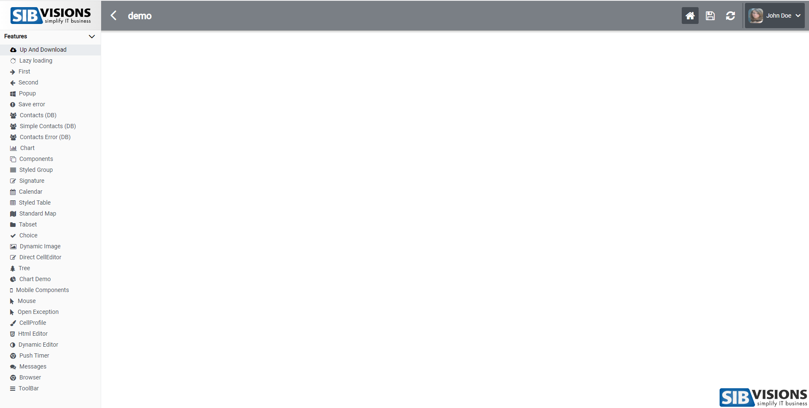
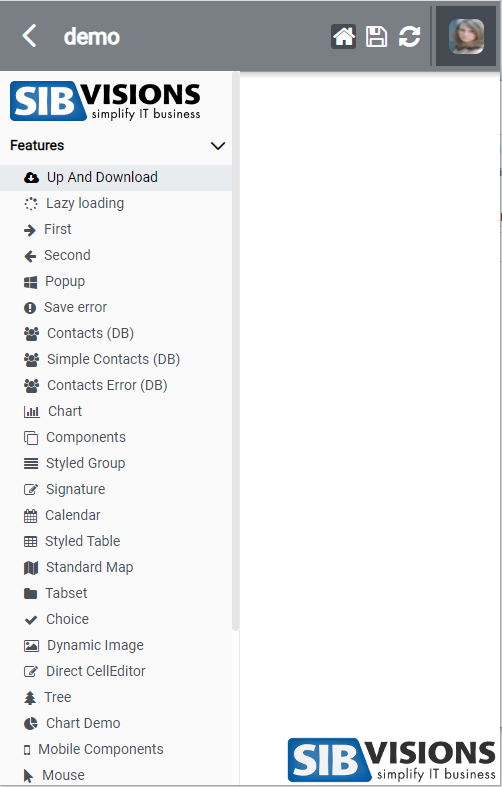
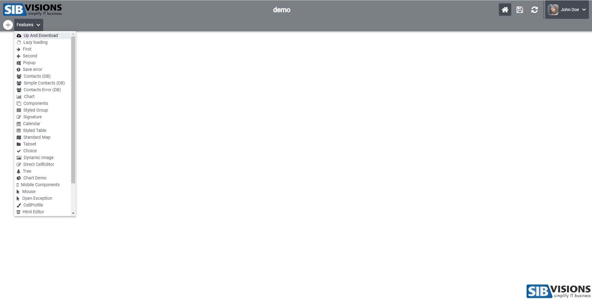
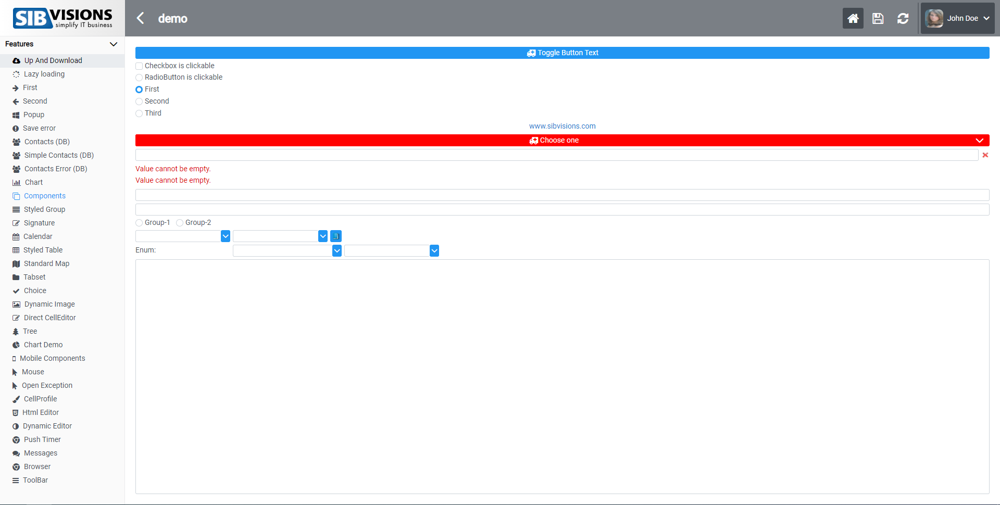
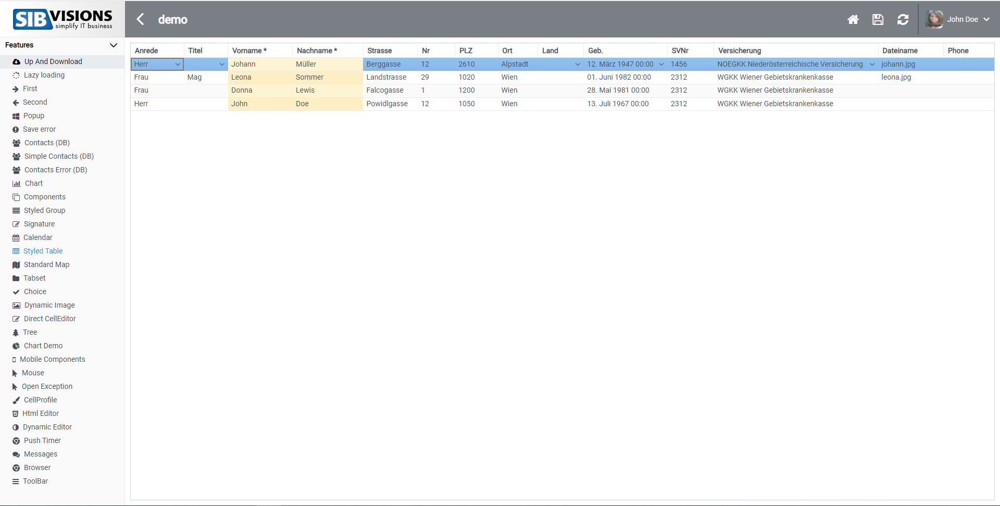

# Screenshots for basti_small Theme
This is the small theme of the reactUI. In the following screenshots, I have enabled hovering on some elements to show their size. Basically the paddings of the menu-items and other components are a lot smaller.

## Standard Menu Fullscreen

## Standard Menu Small

## Corporation Menu

## Components Screen

## Table Screen

