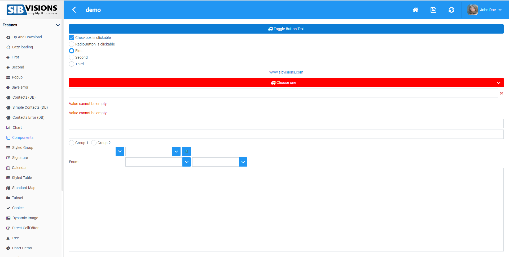
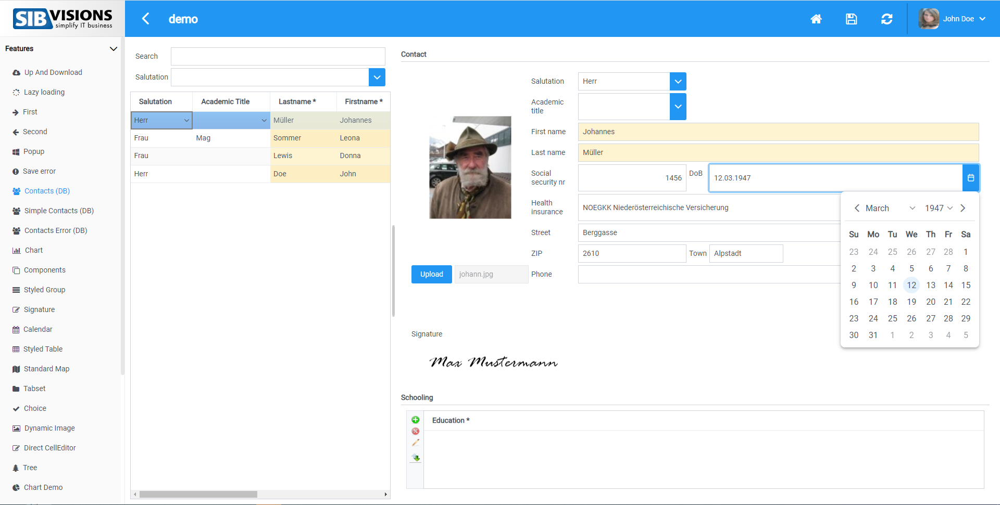
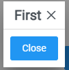
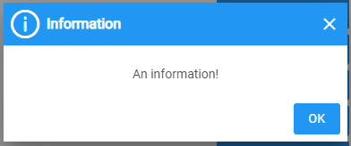
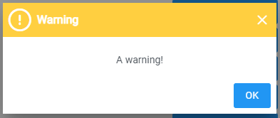
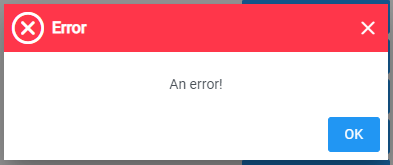
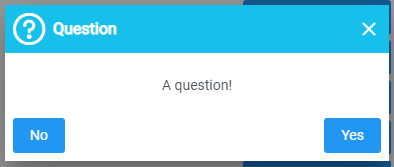

# Blue Color-Scheme Showcase
This is the blue color scheme, it features an blue topbar and white-blue components

## Login Mask

## Components Screen

## Contacts Screen

## Popups

## Messages

