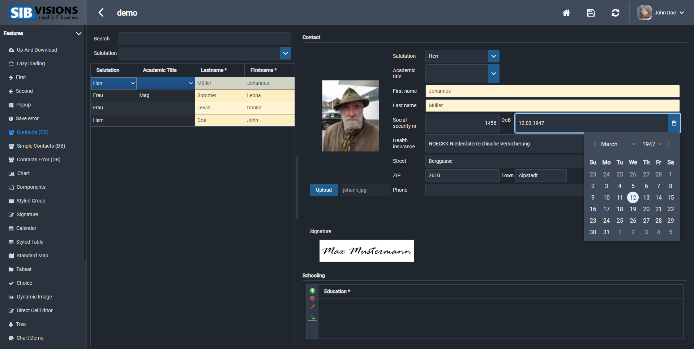
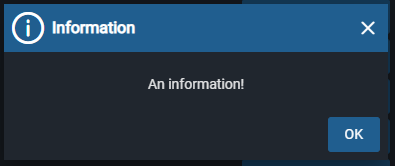
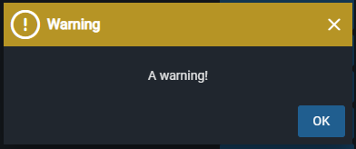
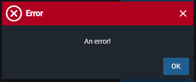
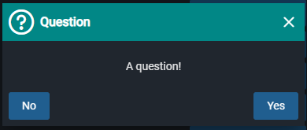

# Dark Color-Scheme Showcase
This is the dark color scheme, it is the reactUI's dark-mode if you want to rest your eyes. Instead of bright colors, dark ones will be used instead

## Login Mask

## Components Screen

## Contacts Screen

## Popups

## Messages

