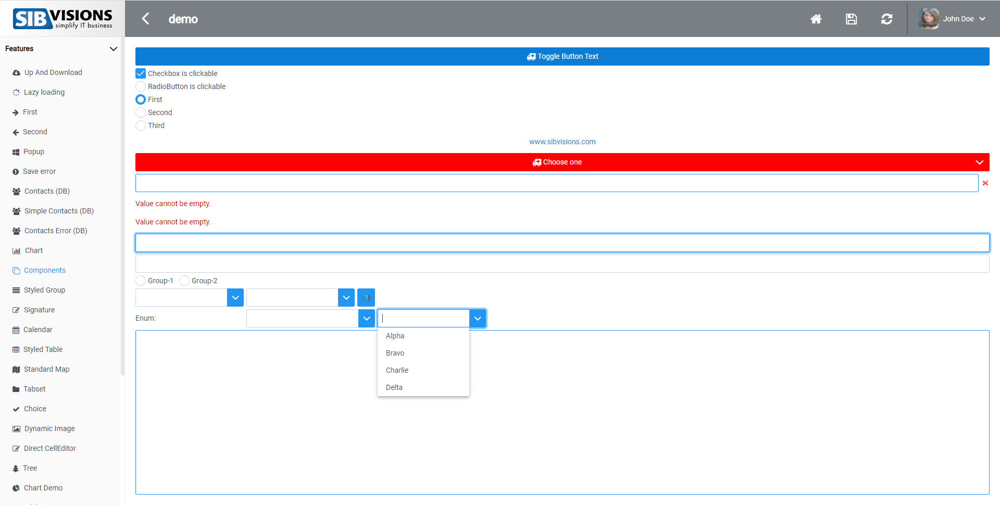
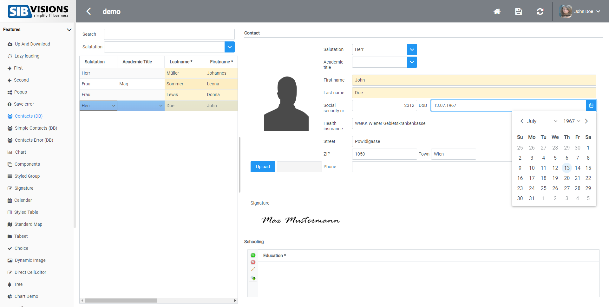
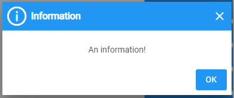
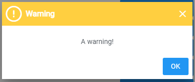
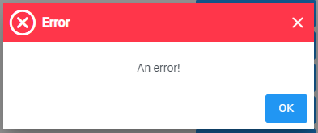
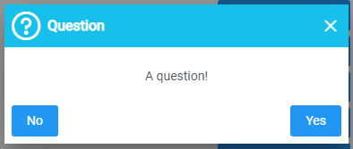

# Default Color-Scheme Showcase
This is the default color scheme of the reactUI, it features a gray topbar and mostly white-blue components.

## Login Mask

## Components Screen

## Contacts Screen

## Popups

## Messages

