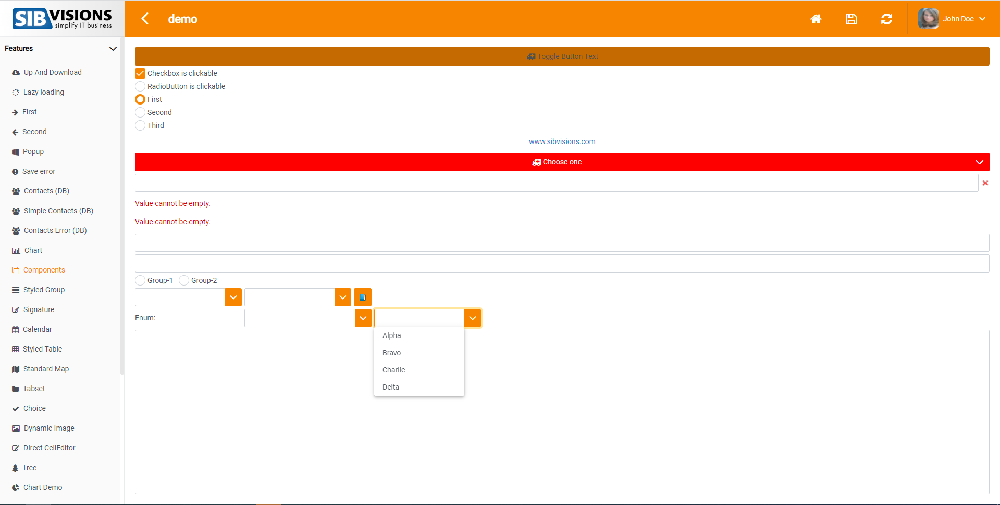
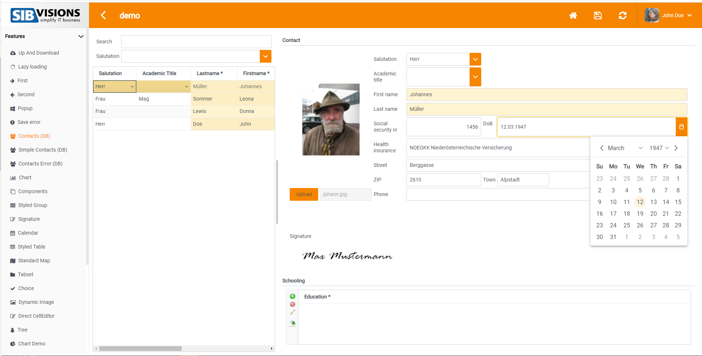
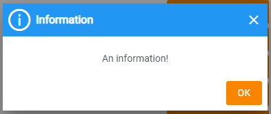
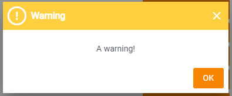
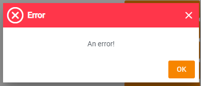
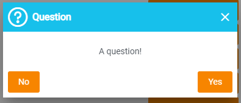

# Orange Color-Scheme Showcase
This is the orange color scheme, it features an orange topbar and white-orange components

## Login Mask

## Components Screen

## Contacts Screen

## Popups

## Messages

